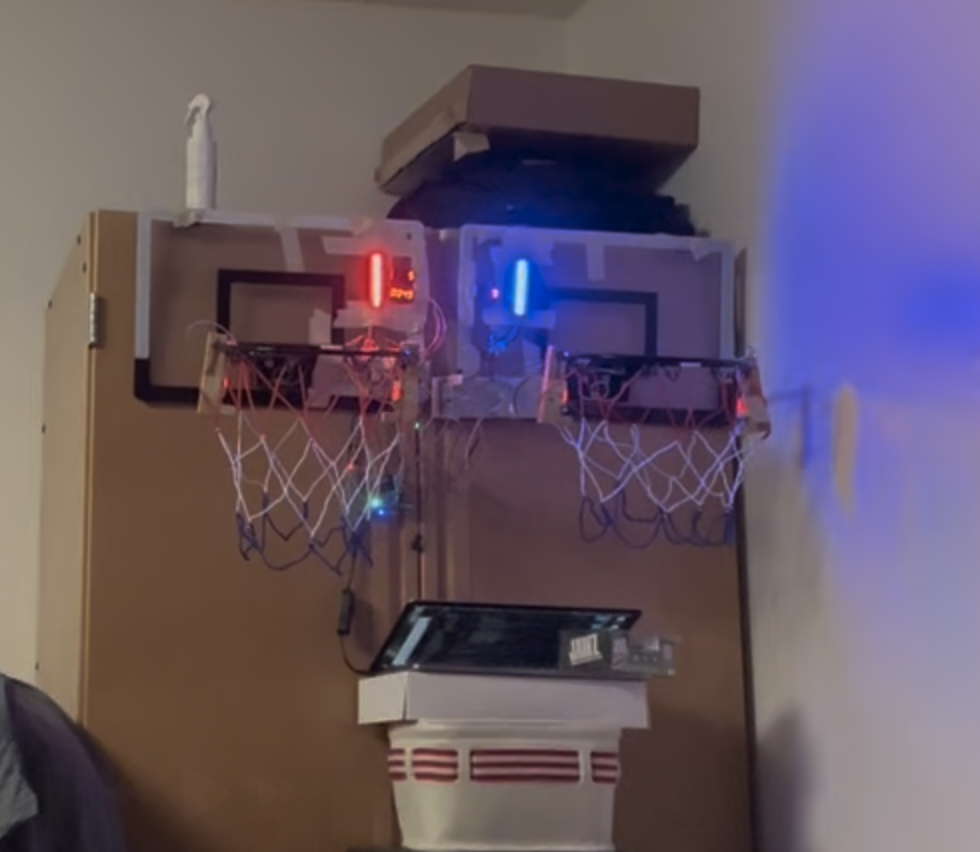

# mango-basketball-game
Project Title

Custom Mango Pi Basketball Arcade Game

Project Description

This is a recreation of the basketball arcade game pop a shot, however it is ran entirely locally off of a mango Pi using its GPIO pins in conjunction with the Stanford CS107e
mango Pi libraries written by myself and my teammate John Carlson.

Features

- Custom game modes
- Real-time LED animations
- Sound effects for scoring and time notifications
- 2 IR obstacle avoidance sensors on each basketball hoop

References

I utilized Professor Julie Zelenski's dotstar code for the majority of the code handling data, and writing to the led strip what color you wanted to display. The code related to setting a separate pair of pins to spi mosi and spi clk were written by me, using a bit banging method explained in blogs like this: https://circuitdigest.com/article/introduction-to-bit-banging-spi-communication-in-arduino-via-bit-banging

Some of the display module was made adapted from avishorp@gmail.com's arduino implementation for controlling a display using a tm1637 chip. The link to his code can be found here: https://github.com/avishorp/TM1637/blob/master/TM1637Display.cpp. While a lot of his code utilized functions found in arduino libraries we utilized mango pi libraries to make a port of the code, and then made several functions like start countdown, display num, etc. which was more personalized to our needs. I had used some of the same structure for writing the data to the chip but made my own functions to display numbers.
